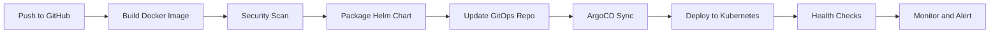

# AKS Production-Grade POC Setup

A comprehensive, production-ready Azure Kubernetes Service (AKS) Proof of Concept (POC) implementation with CI/CD, GitOps, observability, and GPU workloads support.

## 📋 Overview
This project provides a complete, step-by-step guide for setting up a production-grade AKS environment with:
- **Infrastructure as Code (IaC)**: Terraform configurations for Azure resources
- **CI/CD Pipeline**: GitHub Actions for automated builds and deployments
- **GitOps**: ArgoCD for continuous delivery and configuration management
- **Observability**: Prometheus, Grafana, and Azure Monitor integration
- **Ingress & Load Balancing**: NGINX Ingress Controller with SSL/TLS
- **Helm Charts**: Application packaging and deployment
- **Sample Application**: Lightweight Python Flask app with PostgreSQL
- **GPU Workloads**: Cost-effective GPU setup for ML/AI workloads
- **Security**: RBAC, secrets management, network policies

## 🏗️ Architecture
```
GitHub Repo → GitHub Actions → Azure Infra → Kubernetes Cluster → Observability Stack
```

## 📚 Documentation
| Document | Description |
|----------|-------------|
| [AKS-POC-Guide.html](AKS-POC-Guide.html) | Complete visual guide with step-by-step deployment, architecture diagrams, and technology explanations |
| [01-HLD.md](docs/01-HLD.md) | High-Level Design - System architecture and design principles |
| [02-LLD.md](docs/02-LLD.md) | Low-Level Design - Detailed technical specifications |
| [03-Observability-Setup.md](docs/03-Observability-Setup.md) | Monitoring stack setup guide |
| [04-LoadBalancer-Ingress.md](docs/04-LoadBalancer-Ingress.md) | Load balancer and ingress configuration |
| [05-GPU-Workloads-Guide.md](docs/05-GPU-Workloads-Guide.md) | GPU workloads setup with cost-effective alternatives |

**📖 Interactive HTML Guide:** Open `AKS-POC-Guide.html` for comprehensive visual guide with architecture diagrams, deployment timeline, and technology explanations.

## 🚀 Quick Start
### Prerequisites
- **Azure Subscription**: `7908ea24-a708-4291-be15-98426e3e9ca5`
- **Azure CLI**: Install from [docs.microsoft.com](https://docs.microsoft.com/en-us/cli/azure/install-azure-cli)
- **Terraform**: Install from [terraform.io](https://www.terraform.io/downloads.html)
- **kubectl**: Install from [kubernetes.io](https://kubernetes.io/docs/tasks/tools/)
- **Helm**: Install from [helm.sh](https://helm.sh/docs/intro/install/)
- **Docker**: Install from [docker.com](https://www.docker.com/get-started)
- **GitHub Account**: For CI/CD and GitOps

### One-Command Deployment
```bash
git clone https://github.com/esarath/aks-poc-setup.git && cd aks-poc-setup && chmod +x scripts/deploy-infrastructure.sh && ./scripts/deploy-infrastructure.sh
```
The script will:
1. Check prerequisites 2. Configure Azure authentication 3. Deploy infrastructure using Terraform 4. Configure AKS and kubectl 5. Deploy observability stack 6. Install ingress controller 7. Set up ArgoCD 8. Deploy sample application 9. Verify all components

## 🔧 Detailed Implementation Steps

### Phase 1: Infrastructure Deployment (Terraform)
#### Step 1.1: Configure Terraform Backend
```bash
cd terraform && az storage account create --name tfstateakspoc123 --resource-group rg-aks-poc --location eastus --sku Standard_LRS && az storage container create --name tfstate --account-name tfstateakspoc123
```
**Command Details:**
- `cd terraform`: Navigate to Terraform configuration directory
- `az storage account create`: Creates Azure Storage Account for Terraform state management
- `--sku Standard_LRS`: Locally redundant storage for cost efficiency
- `az storage container create`: Creates blob storage container for state files
- **Purpose**: Provides remote state storage for team collaboration and state locking

#### Step 1.2: Initialize and Deploy Infrastructure
```bash
terraform init -upgrade -backend-config="resource_group_name=rg-aks-poc" -backend-config="storage_account_name=tfstateakspoc123" -backend-config="container_name=tfstate" && terraform validate && terraform fmt -recursive && terraform plan -var="subscription_id=7908ea24-a708-4291-be15-98426e3e9ca5" -var="resource_group_name=rg-aks-poc" -var="location=eastus" -var="environment=poc" -out=tfplan && terraform apply tfplan
```
**Command Details:**
- `terraform init`: Downloads providers (azurerm, random, helm, kubernetes) and configures backend
- `--upgrade`: Updates provider versions to latest compatible versions
- `--backend-config`: Configures Azure Storage backend for remote state storage
- `terraform validate`: Checks syntax and configuration validity
- `terraform fmt`: Formats code consistently across files
- `terraform plan`: Creates execution plan showing resources to be created/modified/destroyed
- `--var`: Passes variable values (subscription ID, resource group, location, environment)
- `terraform apply`: Executes the planned infrastructure changes
- **Terraform Modules Deployed**:
  - **VNet Module** (`terraform/modules/vnet/`): Creates virtual network (10.0.0.0/16) with 6 subnets
    - AKS system subnet (10.0.1.0/24) for Kubernetes control plane components
    - AKS user subnet (10.0.2.0/24) for application workloads
    - GPU subnet (10.0.3.0/24) for GPU-accelerated workloads
    - Database subnet (10.0.4.0/24) for PostgreSQL database isolation
    - App gateway subnet (10.0.5.0/24) for Azure Application Gateway
    - Bastion subnet (10.0.6.0/24) for Azure Bastion secure access
    - Configures network security groups, route tables, and service endpoints

  - **ACR Module** (`terraform/modules/acr/`): Deploys Azure Container Registry
    - Registry name: aks-poc-acr with Premium SKU
    - Enables geo-replication for multi-region deployment
    - Supports anonymous pull access for AKS integration
    - Integrates with AKS for automatic image pull authentication
    - Provides vulnerability scanning and image compliance checking

  - **Database Module** (`terraform/modules/database/`): Provisions PostgreSQL flexible server
    - Server name: aks-poc-postgres in database subnet
    - SKU: Standard_B2ms (2 vCPUs, 8GB RAM) for cost efficiency
    - Azure AD authentication integration with managed identity
    - Automatic backups with 7-day retention period
    - High availability with zone redundancy
    - Private endpoint for secure network access

  - **Monitoring Module** (`terraform/modules/monitoring/`): Sets up observability stack
    - Log Analytics workspace: aks-poc-log-analytics
    - Azure Monitor integration for AKS Container Insights
    - Metric collection and alerting capabilities
    - Centralized logging for all cluster components
    - Integration with Prometheus and Grafana for enhanced monitoring

  - **AKS Module** (`terraform/modules/aks/`): Creates Kubernetes cluster
    - Cluster name: aks-poc-cluster in eastus region
    - System node pool: 2 nodes, Standard_B2s VM size (2 vCPUs, 4GB RAM)
    - User node pool: 3 nodes, Standard_B4ms VM size (4 vCPUs, 16GB RAM)
    - Azure AD integration for RBAC and authentication
    - Container Insights enabled for monitoring
    - ACR integration for private container registry access
    - Managed identity for pod-to-Azure service authentication
    - Network policy support for pod-level security
    - Cluster autoscaling enabled for automatic node scaling
    - CNI network plugin with Azure CNI for advanced networking
    - Kubernetes version: 1.27.x with automatic upgrades
    - Additional GPU node pool support (optional, for ML/AI workloads)

### Phase 2: Kubernetes Configuration
#### Step 2.1: Configure kubectl Access
```bash
az aks get-credentials --resource-group rg-aks-poc --name aks-poc-cluster --admin && kubectl get nodes && kubectl cluster-info dump && kubectl version --short && kubectl api-resources
```
**Command Details:**
- `az aks get-credentials`: Downloads AKS cluster credentials and updates local kubeconfig file
- `--admin`: Gets admin credentials instead of user credentials (full cluster access)
- `kubectl get nodes`: Lists all Kubernetes nodes to verify cluster connectivity and node status
- `kubectl cluster-info dump`: Dumps cluster information for debugging purposes
- `kubectl version --short`: Shows client and server version information
- `kubectl api-resources`: Lists available API resources on the cluster
- **Purpose**: Enables local Kubernetes cluster access and verifies cluster health

#### Step 2.2: Create Namespaces
```bash
kubectl create namespace monitoring && kubectl create namespace ingress-nginx && kubectl create namespace argocd && kubectl create namespace production && kubectl label namespace monitoring app.kubernetes.io/name=monitoring && kubectl label namespace ingress-nginx app.kubernetes.io/name=ingress-nginx && kubectl label namespace argocd app.kubernetes.io/name=argocd && kubectl label namespace production app.kubernetes.io/name=production
```
**Command Details:**
- `kubectl create namespace`: Creates dedicated namespaces for resource isolation and organization
- **monitoring namespace**: For Prometheus, Grafana, and monitoring components
- **ingress-nginx namespace**: For NGINX Ingress Controller and related resources
- **argocd namespace**: For ArgoCD GitOps deployment and configuration
- **production namespace**: For production application deployments
- `kubectl label namespace`: Adds labels to namespaces for better organization and resource identification
- **Purpose**: Establishes proper Kubernetes namespace structure for multi-tenant environment

### Phase 3: Observability Stack Deployment
#### Step 3.1: Add Helm Repositories
```bash
helm repo add prometheus-community https://prometheus-community.github.io/helm-charts && helm repo add grafana https://grafana.github.io/helm-charts && helm repo add ingress-nginx https://kubernetes.github.io/ingress-nginx && helm repo add jetstack https://charts.jetstack.io && helm repo update
```
**Command Details:**
- `helm repo add`: Adds Helm chart repositories to local configuration
- `prometheus-community`: Official Prometheus community charts (Prometheus, Grafana, Alertmanager)
- `grafana`: Grafana Labs charts for Grafana plugins and applications
- `ingress-nginx`: NGINX Ingress Controller charts for load balancing
- `jetstack`: Jetstack charts for cert-manager and certificate management
- `helm repo update`: Updates local repository cache with latest chart versions
- **Purpose**: Ensures access to latest stable chart versions for deployment

#### Step 3.2: Install kube-prometheus-stack
```bash
cat > observability/prometheus-values.yaml <<EOF
prometheus:
  prometheusSpec:
    retention: 15d
    retentionSize: 50GB
    storageSpec:
      volumeClaimTemplate:
        spec:
          storageClassName: azure-disk
          accessModes: ["ReadWriteOnce"]
          resources:
            requests:
              storage: 50Gi
grafana:
  adminPassword: "change-me-in-production"
  persistence:
    enabled: true
    storageClassName: azure-disk
    size: 10Gi
EOF
helm install prometheus prometheus-community/kube-prometheus-stack --namespace monitoring --create-namespace --values observability/prometheus-values.yaml --timeout 15m && kubectl wait --for=condition=ready pod -l app.kubernetes.io/name=prometheus -n monitoring --timeout=300s && kubectl wait --for=condition=ready pod -l app.kubernetes.io/name=grafana -n monitoring --timeout=300s
```

#### Step 3.3: Enable Azure Monitor
```bash
az aks update --resource-group rg-aks-poc --name aks-poc-cluster --enable-container-insights --workspace-resource-id /subscriptions/7908ea24-a708-4291-be15-98426e3e9ca5/resourceGroups/rg-aks-poc/providers/Microsoft.OperationalInsights/workspaces/aks-poc-log-analytics
```

### Phase 4: Ingress Configuration
#### Step 4.1: Install NGINX Ingress Controller
```bash
cat > observability/nginx-ingress-values.yaml <<EOF
controller:
  replicaCount: 3
  resources:
    requests:
      cpu: 100m
      memory: 128Mi
    limits:
      cpu: 500m
      memory: 512Mi
  metrics:
    enabled: true
    serviceMonitor:
      enabled: true
      namespace: monitoring
EOF
helm install ingress-nginx ingress-nginx/ingress-nginx --namespace ingress-nginx --create-namespace --values observability/nginx-ingress-values.yaml && kubectl get svc ingress-nginx-controller -n ingress-nginx
```

#### Step 4.2: Verify Ingress Controller
```bash
kubectl get pods -n ingress-nginx && kubectl get svc -n ingress-nginx && kubectl run --rm -it --restart=Never --image=curlimages/curl -n ingress-nginx -- curl -- nginx-ingress-controller.ingress-nginx.svc.cluster.local
```

### Phase 5: GitOps with ArgoCD
#### Step 5.1: Install ArgoCD
```bash
kubectl create namespace argocd && kubectl apply -n argocd -f https://raw.githubusercontent.com/argoproj/argo-cd/stable/manifests/install.yaml && kubectl wait --for=condition=ready pod -l app.kubernetes.io/name=argocd-server -n argocd --timeout=300s && ARGOCD_PASSWORD=$(kubectl -n argocd get secret argocd-initial-admin-secret -o jsonpath="{.data.password}" | base64 -d) && echo "ArgoCD password: $ARGOCD_PASSWORD"
```

#### Step 5.2: Apply Custom ArgoCD Configuration
```bash
kubectl apply -f argocd/argocd-cm.yaml -n argocd && kubectl apply -f argocd/argocd-rbac-cm.yaml -n argocd && kubectl apply -f argocd/argocd-project.yaml -n argocd && kubectl apply -f argocd/argocd-application.yaml -n argocd
```

#### Step 5.3: Access ArgoCD UI
```bash
kubectl port-forward svc/argocd-server -n argocd 8080:443
```

### Phase 6: Application Deployment
#### Step 6.1: Build Docker Image
```bash
cd applications/myapp && docker build -t esarathmails/aks-poc-app:latest . && docker login && docker push esarathmails/aks-poc-app:latest
```

#### Step 6.2: Deploy Application via Helm
```bash
cat > helm-charts/myapp/values-prod.yaml <<EOF
replicaCount: 3
image:
  repository: esarathmails/aks-poc-app
  tag: "latest"
  pullPolicy: IfNotPresent
resources:
  limits:
    cpu: 1000m
    memory: 1Gi
  requests:
    cpu: 250m
    memory: 512Mi
database:
  enabled: true
  host: "aks-poc-postgres.postgres.database.azure.com"
  port: 5432
  name: "appdb"
  user: "appuser"
  password: "<your-database-password>"
  sslmode: "require"
EOF
helm install myapp helm-charts/myapp --namespace production --create-namespace --values helm-charts/myapp/values-prod.yaml && kubectl rollout status deployment/myapp -n production --timeout=300s
```

#### Step 6.3: Verify Application Deployment
```bash
kubectl get pods -n production && kubectl get svc -n production && kubectl logs -l app=myapp -n production && kubectl run --rm -it --restart=Never --image=curlimages/curl -n production -- curl -- myapp:8080/health
```

### Phase 7: SSL/TLS Configuration (Optional)
#### Step 7.1: Install cert-manager
```bash
helm repo add jetstack https://charts.jetstack.io && helm repo update && helm install cert-manager jetstack/cert-manager --namespace cert-manager --create-namespace --version v1.13.1 --set installCRDs=true && kubectl get pods -n cert-manager && kubectl get crds | grep cert-manager
```

#### Step 7.2: Create ClusterIssuer
```bash
kubectl apply -f - <<EOF
apiVersion: cert-manager.io/v1
kind: ClusterIssuer
metadata:
  name: letsencrypt-prod
spec:
  acme:
    server: https://acme-v02.api.letsencrypt.org/directory
    email: esarathmails@gmail.com
    privateKeySecretRef:
      name: letsencrypt-prod-private-key
    solvers:
    - http01:
        ingress:
          class: nginx
EOF
```

#### Step 7.3: Configure Ingress with SSL
```bash
kubectl apply -f - <<EOF
apiVersion: networking.k8s.io/v1
kind: Ingress
metadata:
  name: myapp-ingress
  namespace: production
  annotations:
    cert-manager.io/cluster-issuer: "letsencrypt-prod"
    nginx.ingress.kubernetes.io/ssl-redirect: "true"
spec:
  ingressClassName: nginx
  tls:
  - hosts:
    - app.example.com
    secretName: myapp-tls
  rules:
  - host: app.example.com
    http:
      paths:
      - path: /
        pathType: Prefix
        backend:
          service:
            name: myapp
            port:
              number: 8080
EOF
```

### Phase 8: GPU Workloads Setup (Optional)
#### Step 8.1: Create GPU Node Pool
```bash
az aks nodepool add --resource-group rg-aks-poc --cluster-name aks-poc-cluster --name gpu --node-count 0 --node-vm-size Standard_NC4as_T4_v3 --node-osdisk-size 100 --node-osdisk-type Premium_LRS --enable-cluster-autoscaler --min-count 0 --max-count 2 --priority Spot --eviction-policy Delete --spot-max-price -1 --labels accelerator=nvidia-tesla-t4 --workload-runtime Spoke --node-taints "nvidia.com/gpu=true:NoSchedule"
```

#### Step 8.2: Install NVIDIA Device Plugin
```bash
kubectl create namespace gpu-operator && helm repo add nvidia https://nvidia.github.io/nvidia-dcgm-exporter/helm-charts && helm repo update && helm install nvidia-device-plugin nvidia/device-plugin --namespace gpu-operator --set-device-plugin.enabled=true && kubectl describe nodes | grep -i gpu
```

#### Step 8.3: Deploy Sample GPU Application
```bash
kubectl apply -f - <<EOF
apiVersion: apps/v1
kind: Deployment
metadata:
  name: tensorflow-gpu
  namespace: production
spec:
  replicas: 1
  selector:
    matchLabels:
      app: tensorflow-gpu
  template:
    metadata:
      labels:
        app: tensorflow-gpu
    spec:
      containers:
      - name: tensorflow
        image: tensorflow/tensorflow:latest-gpu
        resources:
          limits:
            nvidia.com/gpu: 1
            memory: "8Gi"
          requests:
            nvidia.com/gpu: 1
            memory: "4Gi"
        command: ["python"]
        args: ["-c", "import tensorflow as tf; print(tf.config.list_physical_devices('GPU'))"]
      nodeSelector:
        accelerator: nvidia-tesla-t4
      tolerations:
      - key: nvidia.com/gpu
        operator: Exists
EOF
```

### Manual Deployment

#### 1. Infrastructure Setup

```bash
# Login to Azure (authenticate to Azure CLI)
az login
az account set --subscription 7908ea24-a708-4291-be15-98426e3e9ca5

# Navigate to Terraform directory (IaC configuration files)
cd terraform

# Initialize Terraform (download providers, set up state file)
terraform init -upgrade

# Plan infrastructure changes (review before applying)
terraform plan -var="subscription_id=7908ea24-a708-4291-be15-98426e3e9ca5" -var="environment=poc" -out=tfplan

# Apply infrastructure changes (create Azure resources)
terraform apply tfplan
```

**Command Details:**
- `az login`: Authenticates to Azure CLI using browser or device code
- `az account set`: Sets the active Azure subscription for all CLI commands
- `terraform init`: Downloads required providers (azurerm, random, helm, kubernetes) and initializes backend
- `terraform plan`: Creates execution plan showing what resources will be created/modified
- `terraform apply`: Actually provisions the Azure infrastructure defined in Terraform files

#### 2. Configure Kubernetes Access

```bash
# Get AKS credentials (downloads kubeconfig file)
az aks get-credentials --resource-group rg-aks-poc --name aks-poc-cluster --admin

# Verify cluster access (check node status and cluster connectivity)
kubectl get nodes
```

**Command Details:**
- `az aks get-credentials`: Downloads AKS cluster credentials and updates local kubeconfig file
- `--admin`: Gets admin credentials instead of user credentials (full cluster access)
- `kubectl get nodes`: Lists all Kubernetes nodes to verify cluster connectivity and node status

#### 3. Deploy Monitoring Stack

```bash
# Add Helm repositories (add Prometheus charts to Helm)
helm repo add prometheus-community https://prometheus-community.github.io/helm-charts && helm repo update

# Install Prometheus and Grafana (complete monitoring stack)
helm install prometheus prometheus-community/kube-prometheus-stack --namespace monitoring --create-namespace --values observability/prometheus-values.yaml
```

**Command Details:**
- `helm repo add`: Adds Helm chart repository to local Helm configuration
- `helm repo update`: Updates local repository cache to get latest chart versions
- `helm install`: Installs kube-prometheus-stack (includes Prometheus, Grafana, Alertmanager, Node Exporter)
- `--create-namespace`: Creates monitoring namespace if it doesn't exist
- `--values`: Applies custom configuration from values file for storage, retention, and credentials

#### 10. NGINX Ingress Controller Configuration
```bash
cat > observability/nginx-ingress-values.yaml <<EOF
controller:
  replicaCount: 3
  resources:
    requests:
      cpu: 100m
      memory: 128Mi
    limits:
      cpu: 500m
      memory: 512Mi
  metrics:
    enabled: true
    serviceMonitor:
      enabled: true
      namespace: monitoring
EOF
helm install ingress-nginx ingress-nginx/ingress-nginx --namespace ingress-nginx --create-namespace --values observability/nginx-ingress-values.yaml && kubectl get svc ingress-nginx-controller -n ingress-nginx
```
**Command Details:**
- **replicaCount: 3**: High availability with 3 NGINX ingress controller pods
- **Resource Requests**: 100m CPU, 128Mi RAM minimum resources per pod
- **Resource Limits**: 500m CPU, 512Mi RAM maximum resources per pod
- **Metrics Enabled**: Prometheus metrics collection for monitoring ingress performance
- **ServiceMonitor Integration**: Automatically creates Prometheus ServiceMonitor CRD
- **Ingress Class**: Configures default Kubernetes ingress class annotation
- **External IP**: Azure Load Balancer automatically assigns public IP address
- **Health Checks**: Configures liveness and readiness probes for controller pods
- **SSL Passthrough**: Supports TLS termination at application level if needed
- **Rate Limiting**: Configures rate limiting for DDoS protection and traffic management
```bash
cat > observability/nginx-ingress-values.yaml <<EOF
controller:
  replicaCount: 3
  resources:
    requests:
      cpu: 100m
      memory: 128Mi
    limits:
      cpu: 500m
      memory: 512Mi
  metrics:
    enabled: true
    serviceMonitor:
      enabled: true
      namespace: monitoring
EOF
helm install ingress-nginx ingress-nginx/ingress-nginx --namespace ingress-nginx --create-namespace --values observability/nginx-ingress-values.yaml && kubectl get svc ingress-nginx-controller -n ingress-nginx
```
**Configuration Details** (from `terraform/modules/aks/main.tf`):
- **ReplicaCount: 3**: High availability with 3 NGINX ingress controller pods
- **Resource Requests**: 100m CPU, 128Mi RAM minimum resources per pod
- **Resource Limits**: 500m CPU, 512Mi RAM maximum resources per pod
- **Metrics Enabled**: Prometheus metrics collection for monitoring ingress performance
- **ServiceMonitor Integration**: Automatically creates Prometheus ServiceMonitor CRD
- **Ingress Class**: Configures default Kubernetes ingress class annotation
- **External IP**: Azure Load Balancer automatically assigns public IP address
- **Health Checks**: Configures liveness and readiness probes for controller pods
- **SSL Passthrough**: Supports TLS termination at application level if needed
- **Rate Limiting**: Configures rate limiting for DDoS protection and traffic management

```bash
# Install NGINX Ingress Controller (load balancing and SSL termination)
helm install ingress-nginx ingress-nginx/ingress-nginx --namespace ingress-nginx --create-namespace
```

**Command Details:**
- `helm install ingress-nginx`: Deploys NGINX Ingress Controller to Kubernetes cluster
- `ingress-nginx/ingress-nginx`: Specifies the chart from ingress-nginx Helm repository
- `--namespace ingress-nginx`: Deploys to dedicated ingress namespace
- `--create-namespace`: Creates namespace if it doesn't exist
- **Purpose**: Provides external HTTP/HTTPS routing, SSL termination, load balancing for applications

#### 10. ArgoCD Installation and Configuration
```bash
kubectl create namespace argocd && kubectl apply -n argocd -f https://raw.githubusercontent.com/argoproj/argo-cd/stable/manifests/install.yaml && kubectl apply -f argocd/argocd-application.yaml && kubectl apply -f argocd/argocd-project.yaml
```
**Command Details:**
- `kubectl create namespace argocd`: Creates dedicated namespace for ArgoCD components
- `kubectl apply -f .../install.yaml`: Installs ArgoCD from official manifests (API server, application controller, UI, repository server, Redis)
- `argocd-application.yaml`: Defines application sync settings, Git repository connection, sync policies
- `argocd-project.yaml`: Defines project boundaries, access control policies, resource quotas
- **From:** `argocd/` directory - Configures GitOps workflow for continuous deployment
- **Components Installed**: ArgoCD API server, application controller, UI, repository server, Redis, Dex (authentication)
- **Sync Strategy**: Automatic synchronization with Git repository (self-healing, auto-correction of drift)
- **Access**: UI accessible via port-forward (kubectl port-forward svc/argocd-server -n argocd 8080:443)

```bash
# Install ArgoCD (GitOps continuous delivery tool)
kubectl create namespace argocd && kubectl apply -n argocd -f https://raw.githubusercontent.com/argoproj/argo-cd/stable/manifests/install.yaml

# Apply custom configuration (application and project definitions)
kubectl apply -f argocd/argocd-application.yaml && kubectl apply -f argocd/argocd-project.yaml
```

**Command Details:**
- `kubectl create namespace argocd`: Creates dedicated namespace for ArgoCD components
- `kubectl apply`: Installs ArgoCD from official manifests (API server, application controller, UI, etc.)
- `argocd-application.yaml`: Defines application sync settings and Git repository connection
- `argocd-project.yaml`: Defines project boundaries and access control policies
- **Purpose**: Enables GitOps workflow where Git repository becomes the single source of truth for deployments

#### 11. Application Deployment via Helm
```bash
cat > helm-charts/myapp/values-prod.yaml <<EOF
replicaCount: 3

image:
  repository: esarathmails/aks-poc-app
  tag: "latest"
  pullPolicy: IfNotPresent

resources:
  limits:
    cpu: 1000m
    memory: 1Gi
  requests:
    cpu: 250m
    memory: 512Mi

database:
  enabled: true
  host: "aks-poc-postgres.postgres.database.azure.com"
  port: 5432
  name: "appdb"
  user: "appuser"
  password: "<your-database-password>"
  sslmode: "require"
EOF
helm install myapp helm-charts/myapp --namespace production --create-namespace --values helm-charts/myapp/values-prod.yaml && kubectl rollout status deployment/myapp -n production --timeout=300s
```
**Command Details:**
- **replicaCount: 3**: Deploy 3 application pods for high availability
- **image.repository**: Docker image from Docker Hub (esarathmails/aks-poc-app)
- **resources.limits**: Maximum resources (1 CPU core, 1GB RAM per pod)
- **resources.requests**: Minimum guaranteed resources (250m CPU, 512MB RAM per pod)
- **database.host**: PostgreSQL server FQDN (from Terraform module)
- **database.sslmode**: "require" for encrypted database connections
- **helm install**: Deploys Flask application with PostgreSQL database
- **--namespace production**: Deploys to production namespace
- **kubectl rollout status**: Waits for deployment to complete successfully
- **From:** `helm-charts/myapp/` directory - Helm chart configuration for Flask application
- **Application Features**: REST API endpoints, health monitoring, database integration, metrics export

```bash
# Install application using Helm (package and deploy Flask application)
helm install myapp helm-charts/myapp --namespace production --create-namespace --values helm-charts/myapp/values-prod.yaml
```

**Command Details:**
- `helm install myapp`: Installs the application release named "myapp"
- `helm-charts/myapp`: Specifies the local Helm chart directory for the application
- `--namespace production`: Deploys to production namespace
- `--create-namespace`: Creates production namespace if it doesn't exist
- `--values values-prod.yaml`: Applies production-specific configuration (replicas, resources, database credentials)
- **Application**: Flask web application with PostgreSQL database, REST API endpoints, and health monitoring

#### Monitoring Module (`terraform/modules/monitoring/`)
**From main.tf**: Log Analytics workspace with Application Insights and alerting
```terraform
resource "azurerm_log_analytics_workspace" "main" {
  name                = var.log_analytics_workspace_name
  sku                 = var.log_analytics_sku
  retention_in_days   = var.log_analytics_retention_days
  daily_quota_gb       = -1  # Unlimited quota
  internet_ingestion_enabled = true
}
resource "azurerm_application_insights" "main" {
  name                = var.application_insights_name
  application_type    = var.application_insights_type
  workspace_id         = azurerm_log_analytics_workspace.main[0].id
  daily_data_cap_in_gb = 100
  sampling_percentage = 100.0
}
resource "azurerm_monitor_private_link_scope" "main" {
  name = "aks-poc-monitor-pls"
}
resource "azurerm_monitor_metric_alert" "cpu_alert" {
  name                = "cpu-usage-alert"
  resource_id         = var.monitor_target_resource_id
  metric_name         = "cpu_percentage"
  aggregation         = "Average"
  operator            = "GreaterThan"
  threshold           = 80
  action_group_id    = azurerm_monitor_action_group.main.id
}
```
**Technical Details**: Unlimited daily quota, workspace-based Application Insights with 100GB daily cap, CPU threshold alerts at 80%, private link scope for secure monitoring data access, sampling percentage 100% for full data collection.

**AKS Module Variables** (from `terraform/modules/aks/variables.tf`):
- `resource_group_name`: Target Azure resource group for AKS deployment
- `location`: Azure region (eastus, westus2, etc.) for infrastructure placement
- `aks_cluster_name`: Cluster name (aks-poc-cluster) for identification
- `aks_dns_prefix`: DNS prefix for API server (aks-poc-cluster.eastus.cloudapp.azure.com)
- `kubernetes_version`: Kubernetes version (1.27.x) with automatic upgrade enabled
- `vnet_id`: Virtual network ID for AKS network integration
- `system_node_pool_vm_size`: VM size for system nodes (Standard_B2s = 2 vCPU, 4GB RAM)
- `enable_auto_scaling`: Enable node pool auto-scaling based on resource demand
- `enable_azure_ad_integration`: Enable Azure AD RBAC for cluster authentication
- `azure_ad_admin_group_id`: Azure AD group ID for cluster administrators
- `enable_monitoring`: Enable Azure Monitor Container Insights integration
- `network_plugin`: Network plugin (azure vs kubenet) - Azure CNI for advanced networking
- `network_policy`: Network policy (calico vs azure) - Calico for pod security
- `load_balancer_sku`: Load balancer type (Standard vs Basic) - Standard for SLA
- `service_cidr`: Service IP range for Kubernetes services
- `pod_cidr`: Pod IP range for Kubernetes pods (10.244.0.0/16)

**AKS Cluster Configuration Details**:
- **Kubernetes Version**: 1.27.x with automatic upgrades enabled
- **System Node Pool**: 2 nodes, Standard_B2s (2 vCPU, 4GB RAM), OS disk 30GB Premium LRS
- **User Node Pool**: 3 nodes, Standard_B4ms (4 vCPU, 16GB RAM), auto-scale 1-10 nodes
- **GPU Node Pool**: 0 nodes, Standard_NC4as_T4_v3 (NVIDIA T4 GPU), spot pricing
- **Network Plugin**: Azure CNI (advanced networking with VNet integration)
- **Network Policy**: Calico (network policies for pod security)
- **Load Balancer**: Standard SKU (enterprise-grade SLA, multiple frontend IPs)
- **Pod CIDR**: 10.244.0.0/16 (65,536 available pod IPs)
- **Service CIDR:**: Configurable service IP range for Kubernetes services
- **Auto-scaling**: Enabled with min/max node count configuration
- **Azure AD**: Enabled with managed Azure AD integration
- **RBAC**: Azure RBAC enabled for role-based access control
- **Monitoring**: Container Insights with Log Analytics integration
- **Private Cluster**: Optional (no public API endpoint)

### Terraform Module Configurations

#### VNet Module (`terraform/modules/vnet/`)
**From main.tf**: Creates virtual network with 6 subnets and AKS delegation
```terraform
resource "azurerm_virtual_network" "main" {
  name                = "vnet-aks-poc"
  address_space       = [var.vnet_address_space] # 10.0.0.0/16
}
resource "azurerm_subnet" "aks_system" {
  name                 = "aks-system-subnet"
  address_prefixes     = [var.aks_system_subnet_cidr] # 10.0.1.0/24
  delegation {
    name = "aks-delegation"
    service_delegation {
      name = "Microsoft.ContainerService/managedClusters"
      actions = [
        "Microsoft.Network/virtualNetworks/subnets/join/action",
        "Microsoft.Network/virtualNetworks/subnets/prepareNetworkPolicies/action"
      ]
    }
  }
}
```
**Technical Details**: AKS delegation allows AKS to manage subnet IP addresses and apply network policies for pod networking.

#### ACR Module (`terraform/modules/acr/`)
**From main.tf**: Container registry with security policies and webhook
```terraform
resource "azurerm_container_registry" "acr" {
  name                = var.acr_name
  sku                 = var.acr_sku # Premium SKU
  network_rule_set {
    default_action = "Allow"
  }
  retention_policy {
    days    = 30
    enabled = true
  }
  anonymous_pull_enabled = var.anonymous_pull_enabled
}
resource "azurerm_container_registry_webhook" "image_push" {
  name                = "image-push-webhook"
  scope       = "myapp:*"
  actions     = ["push"]
}
```
**Technical Details**: Premium SKU enables geo-replication, image signing, and vulnerability scanning.

#### Database Module (`terraform/modules/database/`)
**From main.tf**: PostgreSQL with Azure AD authentication and private networking
```terraform
resource "azurerm_postgresql_server" "postgres" {
  name                = var.postgresql_server_name
  sku_name            = var.postgresql_sku_name # Standard_B2ms
  version             = var.postgresql_version
  public_network_access_enabled    = false
  ssl_enforcement_enabled          = true
  auto_grow_enabled        = true
  backup_retention_days = 7
}
resource "azurerm_postgresql_database" "appdb" {
  name                = "appdb"
  charset             = "UTF8"
  collation           = "English_United States.1252"
}
resource "azurerm_postgresql_virtual_network_rule" "aks_user" {
  name                = "aks-user-vnet-rule"
  subnet_id           = module.vnet.aks_user_subnet_id
}
```
**Technical Details**: Public network disabled for security, auto-grow storage scales automatically, Azure AD authentication via managed identity.

### Terraform Infrastructure Commands

#### 1. VNet Module Configuration Commands
```bash
# Creates virtual network with 6 subnets
terraform apply -target=module.vnet
```
**Terraform Resources Created** (from `terraform/modules/vnet/main.tf`):
- `azurerm_virtual_network`: Main VNet "vnet-aks-poc" with address space 10.0.0.0/16
- `azurerm_subnet "aks_system"`: Subnet 10.0.1.0/24 with AKS delegation for managed cluster operations
- `azurerm_subnet "aks_user"`: Subnet 10.0.2.0/24 for application workloads
- `azurerm_subnet "aks_gpu"`: Subnet 10.0.3.0/24 for GPU-accelerated workloads
- `azurerm_subnet "database"`: Subnet 10.0.4.0/24 for PostgreSQL private endpoint
- `azurerm_subnet "app_gateway"`: Subnet 10.0.5.0/24 for Azure Application Gateway
- `azurerm_subnet "bastion"`: Subnet 10.0.6.0/24 for Azure Bastion secure access
- **Network Security Groups**: Each subnet gets NSG with rules for allowed traffic
- **Service Endpoints**: Azure services (PostgreSQL, Key Vault, Storage) accessible from VNet

#### 2. ACR Module Configuration Commands
```bash
# Creates Azure Container Registry with Premium SKU
terraform apply -target=module.acr
```
**Terraform Resources Created** (from `terraform/modules/acr/main.tf`):
- `azurerm_container_registry`: Registry "aks-poc-acr" with Premium SKU tier
- Premium SKU enables: geo-replication, content trust, vulnerability scanning
- `azurerm_container_registry_webhook`: Triggers notifications on image push events
- `azurerm_role_assignment`: ACR pull role for AKS managed identity
- **AKS Integration**: Automatic authentication via Azure AD managed identity
- **Anonymous Pull**: Disabled by default for security (can be enabled for specific needs)

#### 3. Database Module Configuration Commands
```bash
# Creates PostgreSQL flexible server with Azure AD authentication
terraform apply -target=module.database
```
**Terraform Resources Created** (from `terraform/modules/database/main.tf`):
- `azurerm_postgresql_flexible_server`: "aks-poc-postgres" with SKU Standard_B2ms (2 vCPUs, 8GB RAM)
- `azurerm_postgresql_flexible_server_database`: "appdb" with UTF-8 encoding
- `azurerm_postgresql_flexible_server_active_directory_admin`: Azure AD admin authentication
- `azurerm_private_endpoint`: Private network endpoint for secure database access
- `azurerm_private_dns_zone`: "privatelink.postgres.database.azure.com" for name resolution
- **Backup Configuration**: 7-day retention with geo-redundant backup
- **High Availability**: Zone-redundant deployment across availability zones
- **Security**: Private endpoint ensures no public internet exposure

#### 4. Monitoring Module Configuration Commands
```bash
# Creates Log Analytics workspace and Azure Monitor integration
terraform apply -target=module.monitoring
```
**Terraform Resources Created** (from `terraform/modules/monitoring/main.tf`):
- `azurerm_log_analytics_workspace`: "aks-poc-log-analytics" for centralized logging
- `azurerm_log_analytics_solution`: Container Insights solution for AKS monitoring
- `azurerm_monitor_action_group`: "aks-poc-alerts" for notification channels
- `azurerm_monitor_metric_alert`: CPU, memory, and disk space alert rules
- **Data Collection**: System logs, performance counters, custom application logs
- **Retention**: 30-day default retention with configurable extension
- **Alerting**: Email, SMS, webhook notifications for threshold-based alerts

#### 5. AKS Module Configuration Commands
```bash
# Creates AKS cluster with multiple node pools and integrations
terraform apply -target=module.aks
```
**Terraform Resources Created** (from `terraform/modules/aks/main.tf`):
- `azurerm_kubernetes_cluster`: "aks-poc-cluster" with comprehensive configuration
- **Kubernetes Version**: 1.27.x with automatic upgrade enabled
- **System Node Pool**: 2 nodes, Standard_B2s (2 vCPU, 4GB RAM), OS Type: Linux
- **User Node Pool**: 3 nodes, Standard_B4ms (4 vCPU, 16GB RAM), auto-scale 1-10 nodes
- **GPU Node Pool**: 0 nodes, Standard_NC4as_T4_v3 (NVIDIA T4 GPU), spot pricing
- **Azure AD Integration**: Enabled with Azure RBAC for cluster administration
- **Container Insights**: Enabled for real-time monitoring and diagnostics
- **ACR Integration**: Attach ACR "aks-poc-acr" for private image pull
- **Managed Identity**: "aks-poc-identity" for pod-to-Azure service authentication
- **Network Plugin**: Azure CNI for advanced networking (VNet integration)
- **Network Policies**: Calico network policies for pod security
- **Outbound Type**: Load balancer for outbound traffic management

### Kubernetes Configuration Commands

#### 6. Namespace Creation with Detailed Explanation
```bash
kubectl create namespace monitoring && kubectl create namespace ingress-nginx && kubectl create namespace argocd && kubectl create namespace production
```
**Kubernetes Resources Created**:
- **monitoring namespace**: Isolated environment for Prometheus, Grafana, Alertmanager components
- **ingress-nginx namespace**: Dedicated space for NGINX Ingress Controller pods and config
- **argocd namespace**: Isolated GitOps environment for ArgoCD server, application controller, UI
- **production namespace**: Production environment for application workloads
- **Isolation Benefits**: Resource quotas, network policies, RBAC separation per namespace
- **Labeling Strategy**: Labels enable resource organization and selective operations

#### 7. Helm Repository Management
```bash
helm repo add prometheus-community https://prometheus-community.github.io/helm-charts
helm repo add grafana https://grafana.github.io/helm-charts
helm repo add ingress-nginx https://kubernetes.github.io/ingress-nginx
helm repo add jetstack https://charts.jetstack.io
helm repo update
```
**Repository Details**:
- **prometheus-community**: Official Prometheus charts (1.3k+ stars, regularly updated)
- **grafana**: Grafana Labs maintained charts (stable and production-ready)
- **ingress-nginx**: Kubernetes ingress controller (official NGINX implementation)
- **jetstack**: cert-manager for TLS certificate automation (Let's Encrypt integration)
- **Update Process**: `helm repo update` fetches latest chart versions and index files
- **Repository Cache**: Stored locally in `~/.cache/helm/repository/` directory

#### 8. Prometheus Stack Configuration
```bash
helm install prometheus prometheus-community/kube-prometheus-stack \
  --namespace monitoring \
  --create-namespace \
  --values observability/prometheus-values.yaml
```
**Detailed Configuration Breakdown**:
- **Prometheus Instance**: 1 replica with 50GB storage, 15-day data retention
- **Prometheus Scraping**: Automatic discovery of Kubernetes pods, services, nodes
- **Scrape Intervals**: Default 15s for targets, 1m for slow targets
- **Grafana Installation**: With 10GB persistent storage for dashboards and user settings
- **Alertmanager**: Configured for Prometheus alert routing to various channels
- **Node Exporter**: Deploys DaemonSet for node-level metrics (CPU, memory, disk, network)
- **Kube-State-Metrics**: Collects Kubernetes object metrics (deployments, pods, services)
- **Service Monitors**: Automatically creates Prometheus CRDs for monitoring targets
- **Grafana Dashboards**: Pre-installed dashboards for cluster, node, and application monitoring

### Main Terraform Files (`terraform/`)

#### **provider.tf** - Terraform Provider Configuration
```hcl
terraform {
  required_version = ">= 1.5.0"
  required_providers {
    azurerm = {
      source  = "hashicorp/azurerm"
      version = "~> 3.74.0"
    }
    random = {
      source  = "hashicorp/random"
      version = "~> 3.6.0"
    }
    helm = {
      source  = "hashicorp/helm"
      version = "~> 2.12.0"
    }
    kubernetes = {
      source  = "hashicorp/kubernetes"
      version = "~> 2.23.0"
    }
  }
  backend "azurerm" {
    resource_group_name  = "tf-state-rg"
    storage_account_name = "tfstateaks poc"
    container_name       = "tfstate"
    key                  = "aks-poc.tfstate"
  }
}
```
**Purpose**: Defines required Terraform version (≥ 1.5.0), configures providers for Azure resources, random string generation, Helm chart deployment, and Kubernetes management. Sets up Azure Storage backend for remote state management with state locking for team collaboration.

#### **variables.tf** - Input Variables
- **Azure Configuration**: subscription_id, location, resource_group_name, tags
- **Network Configuration**: vnet_address_space, subnet CIDRs for AKS system/user/GPU/database/app gateway/bastion
- **AKS Configuration**: cluster name, node pool configurations, Azure AD integration
- **ACR Configuration**: registry name, SKU tier (Basic/Standard/Premium)
- **Database Configuration**: PostgreSQL settings, Azure AD integration
- **Monitoring Configuration**: Log Analytics workspace settings
- **Environment Variables**: environment type (dev/staging/production)

#### **main.tf** - Main Configuration
**Purpose**: Orchestrates all module deployments in correct dependency order:
1. Resource Group → VNet Module → ACR Module → Database Module → Monitoring Module → AKS Module
2. Passes configuration variables to each module
3. Creates dependencies between modules to ensure proper deployment order
4. Integrates module outputs with dependent module inputs

#### **outputs.tf** - Output Values
**Key Outputs**:
- `aks_cluster_id`: AKS cluster resource ID for cross-resource references
- `aks_kube_config`: Kubernetes configuration for external access
- `acr_login_server`: ACR login endpoint for Docker authentication
- `database_connection_string`: PostgreSQL connection string for applications
- `monitoring_workspace_id`: Log Analytics workspace ID for integration
- `vnet_id`: Virtual network ID for additional resource deployment

#### **backend.tf** - State Backend Configuration
**Purpose**: Configures Azure Storage as Terraform backend for:
- Remote state storage (blob storage in Azure)
- State locking (prevents concurrent modifications)
- State encryption (data encryption at rest)
- State versioning (track changes to infrastructure state)

---

### Terraform Modules Detailed Explanation

#### **1. VNet Module** (`terraform/modules/vnet/`)

**Files**:
- `main.tf`: Creates virtual network, 6 subnets, network security groups, route tables
- `variables.tf`: Accepts network configuration (address space, subnet CIDRs, location)
- `outputs.tf`: Outputs subnet IDs, VNet ID, network security group IDs for other modules

**Architecture**:
```
Virtual Network (10.0.0.0/16)
├── AKS System Subnet (10.0.1.0/24) - Kubernetes control plane
├── AKS User Subnet (10.0.2.0/24) - Application pods
├── GPU Subnet (10.0.3.0/24) - GPU workloads (optional)
├── Database Subnet (10.0.4.0/24) - PostgreSQL private endpoint
├── App Gateway Subnet (10.0.5.0/24) - Azure Application Gateway
└── Bastion Subnet (10.0.6.0/24) - Azure Bastion for secure access
```

**Key Features**:
- **Network Security Groups**: Restricts traffic between subnets based on security rules
- **Service Endpoints**: Enables secure Azure service access from private network
- **Route Tables**: Configures routing for subnet-to-subnet communication
- **Bastion Host**: Provides secure RDP/SSH access to VMs without public IPs

**Azure Resources Created**:
- `azurerm_virtual_network`: Main virtual network
- `azurerm_subnet`: 6 subnets with different purposes
- `azurerm_network_security_group`: Security rules for each subnet
- `azurerm_subnet_network_security_group_association`: Links NSGs to subnets
- `azurerm_route_table`: Custom routing for network traffic
- `azurerm_bastion_host`: Secure Azure Bastion deployment

---

#### **2. ACR Module** (`terraform/modules/acr/`)

**Files**:
- `main.tf`: Creates Azure Container Registry with SKU, policies, and integration
- `variables.tf`: Registry name, SKU tier, geo-replication settings
- `outputs.tf`: Registry login server, ID, and integration credentials

**Configuration Options**:
- **SKU Tiers**: Basic (dev/test), Standard (production with geo-replication), Premium (advanced security)
- **Admin User**: Optional admin account for Docker authentication
- **Network Rules**: IP firewall rules, private endpoints, public access settings
- **Policies**: Image retention, quarantine policies, vulnerability scanning

**Azure Resources Created**:
- `azurerm_container_registry`: Main Azure Container Registry
- `azurerm_container_registry_agent_pool`: Build agent pool for image building (Premium SKU)
- `azurerm_container_registry_webhook`: Webhooks for image push notifications
- `azurerm_container_registry_scope_map`: Access control for specific repositories

**AKS Integration**:
- Enables AKS to pull images without Docker credentials
- Uses Azure AD authentication for secure image access
- Supports anonymous pull for public images (optional)
- Automatic image caching in AKS node pools

---

#### **3. Database Module** (`terraform/modules/database/`)

**Files**:
- `main.tf`: Provisions PostgreSQL flexible server with security and backup configuration
- `variables.tf`: Database name, SKU, backup settings, Azure AD integration
- `outputs.tf`: Database connection string, server FQDN, admin credentials

**Architecture**:
```
PostgreSQL Flexible Server
├── Primary Location: Database subnet (private network)
├── High Availability: Zone-redundant deployment
├── Security: Azure AD authentication, private endpoint
├── Storage: Auto-scaling storage (up to 16TB)
└── Backup: 7-35 day retention with point-in-time restore
```

**Key Features**:
- **Azure AD Integration**: Uses managed identities for database authentication (no passwords)
- **Private Endpoint**: Database accessible only from VNet (no public internet exposure)
- **Automatic Backups**: Daily backups with configurable retention (7-35 days)
- **High Availability**: Zone-redundant deployment across availability zones
- **Performance**: Auto-scaling storage based on database growth

**Azure Resources Created**:
- `azurerm_postgresql_flexible_server`: PostgreSQL flexible server
- `azurerm_postgresql_flexible_server_database`: Application database
- `azurerm_private_endpoint`: Private network endpoint for secure access
- `azurerm_private_dns_zone`: Private DNS zone for name resolution
- `azurerm_postgresql_flexible_server_firewall_rule`: Firewall rules for VNet access

**Connection Methods**:
- **Private Endpoint**: Recommended for production (VNet-only access)
- **Azure AD Authentication**: No password management required
- **SSL/TLS**: Encrypted connections by default
- **Connection Pooling**: Optimized for Kubernetes pod connections

---

#### **4. Monitoring Module** (`terraform/modules/monitoring/`)

**Files**:
- `main.tf`: Creates Log Analytics workspace, Azure Monitor integration
- `variables.tf`: Workspace name, location, retention settings
- `outputs.tf`: Workspace ID, primary/secondary keys for integration

**Architecture**:
```
Observability Stack
├── Log Analytics Workspace (aks-poc-log-analytics)
│   ├── Container Insights (AKS monitoring)
│   ├── Application Insights (application monitoring)
│   └── Log Analytics Query Language (KQL) for data analysis
├── Azure Monitor
│   ├── Metrics Collection (CPU, memory, network)
│   ├── Alert Rules (threshold-based notifications)
│   └── Action Groups (email, SMS, webhook alerts)
└── Integration with Prometheus/Grafana
    ├── Prometheus federation
    └── Grafana dashboard integration
```

**Key Features**:
- **Container Insights**: Real-time monitoring of AKS cluster health, performance
- **Log Analytics**: Centralized log collection from containers, nodes, applications
- **Metrics Collection**: CPU, memory, disk, network metrics with 1-minute resolution
- **Alert Rules**: Configurable thresholds for proactive issue detection
- **Data Retention**: 30-day default retention, configurable up to 2 years

**Azure Resources Created**:
- `azurerm_log_analytics_workspace`: Log Analytics workspace for log storage
- `azurerm_log_analytics_solution`: Container Insights solution for AKS monitoring
- `azurerm_monitor_action_group`: Notification channels for alerts
- `azurerm_monitor_metric_alert`: Alert rules for metric thresholds
- `azurerm_monitor_diagnostic_setting`: Diagnostic settings for resource logging

**Data Collection**:
- **Container Logs**: Standard output/error from containers
- **System Logs**: Kubernetes system component logs
- **Performance Metrics**: Node, pod, container performance data
- **Audit Logs**: Kubernetes API audit events
- **Custom Logs**: Application-specific log collection

---

#### **5. AKS Module** (`terraform/modules/aks/`)

**Files**:
- `main.tf`: Creates AKS cluster, node pools, add-ons, network configuration
- `variables.tf`: Cluster configuration, node pools, add-ons, security settings
- `outputs.tf`: Cluster credentials, API server endpoint, node pool information

**Architecture**:
```
AKS Cluster (aks-poc-cluster)
├── System Node Pool (2 nodes, Standard_B2s)
│   ├── Kubernetes control plane components
│   ├── System pods (kube-system namespace)
│   └── Critical cluster services
├── User Node Pool (3 nodes, Standard_B4ms)
│   ├── Application workloads
│   ├── Custom applications
│   └── Auto-scaling based on demand
├── GPU Node Pool (optional, 0 nodes, Standard_NC4as_T4_v3)
│   ├── GPU-accelerated workloads
│   ├── ML/AI model training
│   └── Spot pricing for cost efficiency
└── Add-ons & Integrations
    ├── Azure AD integration (RBAC)
    ├── Container Insights (monitoring)
    ├── ACR integration (private registry)
    ├── Network policies (security)
    └── Managed identity (pod-to-Azure services)
```

**Key Features**:
- **Azure AD Integration**: Uses Azure AD for cluster authentication and RBAC
- **Container Insights**: Built-in monitoring and logging integration
- **ACR Integration**: Automatic authentication for private Docker registry
- **Cluster Autoscaler**: Automatically scales node pools based on resource demand
- **Network Policies**: Controls pod-to-pod communication for security
- **Managed Identity**: Enables pods to access Azure resources without credentials

**Azure Resources Created**:
- `azurerm_kubernetes_cluster`: Main AKS cluster with comprehensive configuration
- `azurerm_kubernetes_cluster_node_pool`: Multiple node pools for different workloads
- `azurerm_user_assigned_identity`: Managed identity for Azure service integration
- `azurerm_role_assignment`: Role assignments for Azure AD and managed identity
- `azurerm_monitor_diagnostic_setting`: AKS diagnostic settings for monitoring

**Node Pool Configurations**:
- **System Pool**: 2 nodes, Standard_B2s (2 vCPU, 4GB RAM), no auto-scaling
- **User Pool**: 3 nodes, Standard_B4ms (4 vCPU, 16GB RAM), auto-scale 1-10 nodes
- **GPU Pool**: 0 nodes, Standard_NC4as_T4_v3 (NVIDIA T4 GPU), spot pricing

**Network Configuration**:
- **CNI Plugin**: Azure CNI for advanced networking (VNet integration)
- **DNS Prefix**: Custom DNS prefix for API server endpoint
- **Outbound Type**: Load balancer or managed NAT for outbound traffic
- **Private Cluster**: Option for private cluster (no public API endpoint)

**Security Features**:
- **Azure AD RBAC**: Role-based access control using Azure AD groups
- **Pod Security Policies**: Controls pod capabilities and access
- **Network Policies**: Restricts pod-to-pod and pod-to-service communication
- **Secret Store Integration**: Azure Key Vault CSI driver for secrets management
- **Workload Identity**: Enables pods to access Azure resources securely

```
aks-poc-setup/
├── docs/                          # Documentation
│   ├── 01-HLD.md                 # High-Level Design
│   ├── 02-LLD.md                 # Low-Level Design
│   ├── 03-Observability-Setup.md  # Monitoring guide
│   ├── 04-LoadBalancer-Ingress.md # Ingress configuration
│   └── 05-GPU-Workloads-Guide.md # GPU setup guide
├── terraform/                     # Infrastructure as Code
│   ├── main.tf                   # Main configuration
│   ├── variables.tf              # Input variables
│   ├── outputs.tf                # Output values
│   ├── provider.tf               # Provider configuration
│   ├── backend.tf                # State backend
│   ├── modules/                  # Terraform modules
│   │   ├── vnet/                 # Network configuration
│   │   ├── aks/                  # AKS cluster
│   │   ├── acr/                  # Container registry
│   │   ├── database/             # Database
│   │   └── monitoring/           # Monitoring resources
│   └── environments/             # Environment-specific configs
│       ├── dev/
│       ├── staging/
│       └── prod/
├── github-actions/                # CI/CD workflows
│   ├── build-push.yml            # Docker image build
│   ├── terraform-deploy.yml      # Infrastructure deployment
│   ├── helm-package.yml          # Helm chart packaging
│   ├── security-scan.yml         # Security scanning
│   ├── deploy-k8s.yml            # Kubernetes deployment
│   └── monitoring-alerts.yml     # Monitoring alerts
├── argocd/                       # ArgoCD configuration
│   ├── argocd-namespace.yaml     # Namespace
│   ├── argocd-cm.yaml           # ConfigMap
│   ├── argocd-rbac-cm.yaml      # RBAC configuration
│   ├── argocd-application.yaml  # Application definition
│   ├── argocd-project.yaml      # Project configuration
│   ├── argocd-ingress.yaml      # Ingress configuration
│   └── install-argocd.sh        # Installation script
├── helm-charts/                  # Helm charts
│   └── myapp/                    # Sample application chart
│       ├── Chart.yaml
│       ├── values.yaml
│       ├── values-prod.yaml
│       └── templates/
│           ├── deployment.yaml
│           ├── service.yaml
│           ├── ingress.yaml
│           ├── hpa.yaml
│           ├── pdb.yaml
│           └── servicemonitor.yaml
├── applications/                  # Sample applications
│   └── myapp/                    # Flask application
│       ├── app.py               # Application code
│       ├── Dockerfile           # Container definition
│       ├── requirements.txt     # Python dependencies
│       ├── tests/              # Test files
│       └── README.md           # App documentation
└── scripts/                      # Deployment scripts
    ├── deploy-infrastructure.sh # Full deployment
    └── destroy-infrastructure.sh # Cleanup script
```

## 🔧 Configuration

### Environment Variables

Create a `.env` file with your configuration:

```bash
# Azure Configuration
export AZURE_SUBSCRIPTION_ID="7908ea24-a708-4291-be15-98426e3e9ca5"
export AZURE_RESOURCE_GROUP="rg-aks-poc"
export AZURE_LOCATION="eastus"

# Docker Configuration
export DOCKER_REGISTRY="docker.io"
export DOCKER_USERNAME="esarathmails"

# GitHub Configuration
export GITHUB_REPO="esarath/aks-poc-setup"
```

### GitHub Secrets

Configure the following secrets in your GitHub repository:

- `AZURE_CLIENT_ID`: Azure service principal client ID
- `AZURE_CLIENT_SECRET`: Azure service principal secret
- `AZURE_TENANT_ID`: Azure tenant ID
- `DOCKER_USERNAME`: Docker Hub username
- `DOCKER_PASSWORD`: Docker Hub password
- `ARGOCD_PASSWORD`: ArgoCD admin password

## 🎯 Key Features

### 1. Infrastructure as Code
- **Terraform**: Complete infrastructure automation
- **Modules**: Reusable Terraform modules
- **State Management**: Azure Storage backend
- **Environment Management**: Multi-environment support

### 2. CI/CD Pipeline
- **GitHub Actions**: Automated build and deployment
- **Multi-stage**: Build, test, scan, deploy
- **Security Scanning**: Trivy, CodeQL, dependency checks
- **Helm Packaging**: Automated chart publishing

### 3. GitOps
- **ArgoCD**: Git-based deployment
- **Automated Sync**: Automatic cluster state synchronization
- **Rollback**: Easy rollback to previous states
- **RBAC**: Role-based access control

### 4. Observability
- **Prometheus**: Metrics collection and storage
- **Grafana**: Visualization and dashboards
- **Azure Monitor**: Cloud-native monitoring
- **Alerting**: Proactive alerting and notification

### 5. Ingress and Load Balancing
- **NGINX Ingress**: Layer 7 routing
- **SSL/TLS**: Automated certificate management
- **Load Balancer**: Azure Load Balancer integration
- **Traffic Management**: Advanced routing capabilities

### 6. Application Deployment
- **Helm Charts**: Application packaging
- **Auto-scaling**: Horizontal Pod Autoscaling
- **Health Checks**: Liveness and readiness probes
- **Resource Management**: CPU and memory optimization

### 7. GPU Workloads
- **Spot Instances**: Cost-effective GPU computing
- **NVIDIA Support**: Complete GPU acceleration
- **ML Frameworks**: TensorFlow, PyTorch support
- **Monitoring**: GPU-specific metrics

## 🔒 Security Features

- **RBAC**: Role-Based Access Control for Kubernetes and Azure
- **Secrets Management**: Azure Key Vault integration
- **Network Policies**: Network segmentation and isolation
- **Container Security**: Image scanning and vulnerability detection
- **SSL/TLS**: Encryption in transit
- **Pod Security Policies**: Security boundaries for pods

## 📊 Monitoring and Observability

### Dashboards
- **Cluster Overview**: Kubernetes cluster health
- **Application Performance**: Application metrics and performance
- **GPU Workloads**: GPU utilization and performance
- **Infrastructure**: Resource usage and capacity

### Alerts
- **Critical**: CPU, memory, disk usage
- **Application**: Error rates, response times
- **Security**: Vulnerability detection
- **Cost**: Budget overruns

## 💰 Cost Optimization

### Strategies
- **Spot Instances**: Up to 90% cost savings for GPU workloads
- **Auto-scaling**: Scale resources based on demand
- **Reserved Instances**: Discounts for long-running workloads
- **Right-sizing**: Optimize resource allocation
- **Monitoring**: Track and control costs

### Estimated Costs (Monthly)
| Component | On-Demand | Spot (90% savings) |
|-----------|-----------|-------------------|
| AKS (2x DS3_v2) | $150 | $15 |
| Monitoring | $50 | $50 |
| Database | $50 | $50 |
| Load Balancer | $20 | $20 |
| **Total** | **$270** | **$135** |

## 🧪 Testing

### Run Tests
```bash
# Application tests
cd applications/myapp
python -m pytest tests/

# Helm chart linting
helm lint helm-charts/myapp

# Terraform validation
cd terraform
terraform validate
```

### Integration Tests
```bash
# Test application endpoints
curl http://app.example.com/health
curl http://app.example.com/api/users

# Check monitoring
kubectl port-forward svc/prometheus-grafana -n monitoring 3000:80
```

## 🔄 CI/CD Workflow



## 🛠️ Troubleshooting
### Common Issues
#### 1. Pod Pending State
```bash
kubectl describe pod <pod-name> -n production && kubectl get nodes && kubectl top nodes && kubectl top pods -A
```

#### 2. Image Pull Errors
```bash
kubectl get secrets && kubectl create secret docker-registry regcred --docker-server=docker.io --docker-username=esarathmails --docker-password=<password>
```

#### 3. Database Connection Issues
```bash
kubectl get pods -n production && kubectl exec -it <app-pod> -- ping <db-host> && kubectl logs <app-pod> -n production
```

### Support Resources
- [AKS Documentation](https://docs.microsoft.com/azure/kubernetes-service/)
- [ArgoCD Documentation](https://argoproj.github.io/argo-cd/)
- [Prometheus Documentation](https://prometheus.io/docs/)
- [Terraform Azure Provider](https://registry.terraform.io/providers/hashicorp/azurerm/latest/docs)

## 📖 Additional Guides

### Development Setup
```bash
git clone https://github.com/esarath/aks-poc-setup.git && cd aks-poc-setup && cd applications/myapp && python -m venv venv && source venv/bin/activate && pip install -r requirements.txt && export DB_HOST=localhost && python app.py
```

### GPU Workloads
See [GPU Workloads Guide](docs/05-GPU-Workloads-Guide.md) for detailed instructions on setting up GPU workloads with cost-effective alternatives.

### Custom Applications
1. Create your application code in `applications/yourapp/` 2. Create a Helm chart in `helm-charts/yourapp/` 3. Update GitHub Actions workflows 4. Configure ArgoCD application 5. Deploy using the provided scripts

## 🤝 Contributing
1. Fork the repository 2. Create a feature branch (`git checkout -b feature/amazing-feature`) 3. Commit your changes (`git commit -m 'Add amazing feature'`) 4. Push to the branch (`git push origin feature/amazing-feature`) 5. Open a Pull Request

## 📄 License
This project is licensed under the MIT License - see the LICENSE file for details.

## 🙏 Acknowledgments
- Azure documentation and examples 2. Kubernetes community 3. ArgoCD and Prometheus projects 4. Helm chart maintainers 5. Open source contributors

## 📞 Support
For support and questions:
- GitHub Issues: [github.com/esarath/aks-poc-setup/issues](https://github.com/esarath/aks-poc-setup/issues)
- Email: esarathmails@gmail.com
- Documentation: See the `docs/` directory

## 🗺️ Roadmap
- [ ] Multi-region deployment 2. Advanced security features 3. Additional GPU configurations 4. Automated testing pipeline 5. Disaster recovery procedures 6. Cost optimization dashboard 7. Integration with additional cloud providers
---
**Generated with [Devin](https://cli.devin.ai/docs) | Co-Authored-By: Devin <158243242+devin-ai-integration[bot]@users.noreply.github.com> | Date: 2026-05-31**